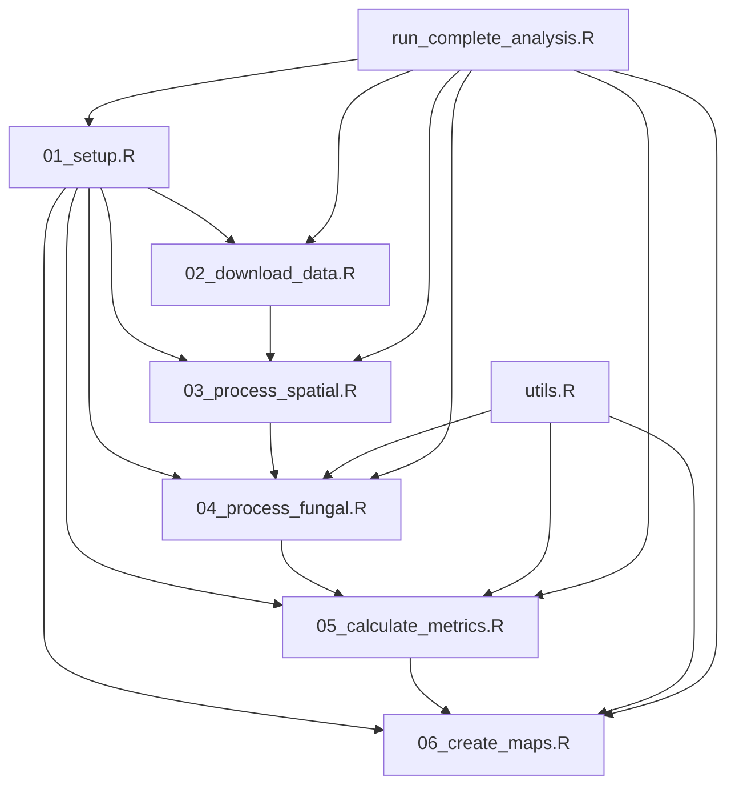

# Scripts Directory

This directory contains the complete R analysis pipeline for the EMF Canada biodiversity analysis.

## Overview

The scripts are designed to run sequentially, with each script building on the outputs of previous ones. They follow a modular design pattern with robust error handling and checkpoint systems.

## Script Dependencies



## Scripts Description

### Core Analysis Pipeline

#### `01_setup.R` - Environment Setup
**Purpose**: Initialize analysis environment and create directory structure

**Key Functions**:
- `setup_emf_analysis()`: Creates directories, sets global options
- `save_session_info()`: Documents R session details

**Outputs**:
- Project directory structure
- Global coordinate reference systems
- Session information files

**Dependencies**: `here`

---

#### `02_download_data.R` - Data Acquisition  
**Purpose**: Download and validate all external datasets

**Key Functions**:
- `download_admin_boundaries()`: GADM country/province boundaries
- `download_ecoregions()`: Canadian ecoregions shapefile
- `download_ustreeatlas()`: US Tree Atlas from GitHub
- `download_natural_earth()`: Natural Earth base data
- `validate_input_files()`: Checks for required input files

**Outputs**:
- `rawdata/admin_boundaries/`: Country boundaries
- `rawdata/ecoregions/`: Canadian ecological regions
- `rawdata/USTreeAtlas/`: Tree species range maps
- `rawdata/natural_earth/`: Base mapping data
- `rawdata/download_summary.rds`: Download log

**Dependencies**: `geodata`, `terra`, `rnaturalearth`, `sf`

**Runtime**: 5-15 minutes (depending on connection)

---

#### `03_process_spatial.R` - Spatial Data Processing
**Purpose**: Process and standardize all spatial datasets

**Key Functions**:
- `process_admin_boundaries()`: Simplify and union country polygons
- `process_tree_ranges()`: Extract Canadian tree species ranges
- `process_ecoregions()`: Standardize ecoregion geometries
- `process_natural_earth()`: Project to Canada Albers

**Outputs**:
- `outdata/canada_simple.gpkg`: Simplified Canada boundary
- `outdata/tree_ranges_canada.gpkg`: Tree species in Canada
- `outdata/ecoregions_processed.gpkg`: Processed ecoregions
- `outdata/canada_ne_albers.gpkg`: Canada in Albers projection

**Dependencies**: `terra`, `sf`, `tidyterra`, `dplyr`

**Runtime**: 10-30 minutes

**Memory Requirements**: 4-8GB RAM

---

#### `04_process_fungal.R` - EMF Data Processing
**Purpose**: Process FungalRoot database and EMF sample data

**Key Functions**:
- `load_fungalroot_data()`: Load mycorrhizal type database
- `assign_mycorrhizal_types()`: Link trees with EMF associations
- `process_emf_samples()`: Spatial processing of sample points
- `aggregate_sample_points()`: Cluster nearby samples
- `calculate_basic_stats()`: Generate summary statistics

**Outputs**:
- `outdata/emf_host_tree_ranges.gpkg`: EMF host species ranges
- `outdata/emf_samples_canada.gpkg`: All EMF sample locations
- `outdata/emf_samples_aggregated_1000m.gpkg`: Clustered samples
- `outdata/basic_emf_stats.rds`: Summary statistics

**Dependencies**: `terra`, `readr`, `tidyterra`, `dplyr`, `magrittr`

**Runtime**: 5-15 minutes

---

#### `05_calculate_metrics.R` - Biodiversity Metrics
**Purpose**: Calculate richness, coverage, and spatial metrics

**Key Functions**:
- `calculate_ecoregion_overlap()`: EMF habitat by ecoregion
- `calculate_sampling_coverage()`: Sampling gaps analysis
- `create_raster_grid()`: Create analysis grid
- `calculate_species_richness()`: Species richness per cell
- `calculate_emf_richness()`: EMF richness per cell
- `calculate_emf_proportion()`: Data coverage proportion

**Outputs**:
- `outdata/species_richness_1deg.tif`: Species richness raster
- `outdata/emf_richness_1deg.tif`: EMF richness raster  
- `outdata/emf_proportion_1deg.tif`: Coverage proportion raster
- `outdata/metrics_summary.rds`: All metrics results

**Dependencies**: `terra`

**Runtime**: 15-45 minutes (depends on resolution)

**Parameters**:
- `resolution_deg`: Grid resolution (default: 1 degree)

---

#### `06_create_maps.R` - Visualization
**Purpose**: Generate all maps and visualizations

**Key Functions**:
- `create_base_map()`: Base Canada map with ecoregions
- `create_sampling_map()`: Sample locations overlay
- `create_emf_richness_map()`: EMF species richness
- `create_emf_proportion_map()`: Data coverage map
- `create_bivariate_map()`: Combined richness/coverage analysis

**Outputs**:
- `figures/canada_sampling_locations_map.png`
- `figures/canada_emf_richness_map.png`
- `figures/canada_emf_proportion_map.png`
- `figures/canada_emf_bivariate_map.png`

**Dependencies**: `ggplot2`, `sf`, `tidyterra`, `patchwork`

**Runtime**: 5-10 minutes

---

### Support Scripts

#### `run_complete_analysis.R` - Master Pipeline
**Purpose**: Execute complete analysis workflow with error handling

**Features**:
- Sequential execution of all scripts
- Error handling and status reporting
- Progress tracking and timing
- Component success/failure summary
- Workspace management

**Usage**:
```r
source("run_complete_analysis.R")
```

**Output**: Complete analysis with status report

---

#### `utils.R` - Utility Functions
**Purpose**: Helper functions for data processing and reporting

**Key Functions**:
- `create_summary_tables()`: Generate CSV summary tables
- `validate_analysis_files()`: Check for required files
- `clean_temp_files()`: Remove temporary files
- `format_kable_table()`: Format tables for reports
- `create_file_inventory()`: Document output files

**Dependencies**: `dplyr`, `knitr`, `kableExtra` (optional), `DT` (optional)

## Usage Patterns

### Complete Analysis
```r
# Run everything at once
source("run_complete_analysis.R")
```

### Step-by-Step Execution
```r
# Set up environment
source("scripts/01_setup.R")

# Download data (optional - can use existing)
source("scripts/02_download_data.R")

# Process spatial data
source("scripts/03_process_spatial.R")

# Process EMF data  
source("scripts/04_process_fungal.R")

# Calculate metrics
source("scripts/05_calculate_metrics.R")

# Create visualizations
source("scripts/06_create_maps.R")
```

### Individual Script Execution
```r
# Load dependencies first
source("scripts/01_setup.R")

# Then run specific script
source("scripts/04_process_fungal.R")
```

## Error Handling

### Checkpoint System
Scripts use checkpoint files to resume interrupted processing:
- `outdata/spatial_processing_checkpoint.rds`
- Progress saved at each major step
- Automatic resume on restart

### Common Error Solutions

**Missing coordinate systems**:
```r
source("scripts/01_setup.R")  # Reloads global CRS
```

**Memory errors in raster processing**:
```r
# Use lower resolution
calculate_all_metrics(resolution_deg = 2)
```

**Download failures**:
```r
# Re-run download with validation
download_all_data()
validate_input_files()
```

**Spatial processing errors**:
```r
# Check for corrupted geometries
terra::makeValid(spatial_object)
```

## Performance Optimization

### Memory Management
- Scripts automatically clean up large objects
- Use `gc()` between major operations
- Monitor memory with `pryr::mem_used()`

### Parallel Processing
Current implementation is sequential, but can be parallelized:
```r
# For species richness calculation
future::plan(multisession)
# Modify calculate_species_richness() to use future_map()
```

### Disk Space Management
- Intermediate files saved as checkpoints
- Use `clean_temp_files()` to remove temporary data
- Large rasters compressed automatically

## Customization

### Changing Resolution
```r
# Use 0.5-degree resolution for higher detail
metrics_summary <- calculate_all_metrics(resolution_deg = 0.5)
maps_summary <- create_all_maps(resolution_deg = 0.5)
```

### Custom Aggregation Distance
```r
# Aggregate samples within 5km instead of 1km
aggregate_sample_points(sample_points_path, distance_threshold = 5000)
```

### Alternative Projections
Edit coordinate systems in `01_setup.R`:
```r
# Use UTM instead of Albers
canada_utm <- "+proj=utm +zone=15 +datum=NAD83 +units=m +no_defs"
```

## Output Validation

### Required Output Files
Run validation to check all outputs were created:
```r
source("scripts/utils.R")
validate_analysis_files()
```

### File Inventory
Generate complete file listing:
```r
create_file_inventory()
# Creates: outdata/file_inventory.csv
```

## Debugging Tips

1. **Enable verbose output**: Set `options(verbose = TRUE)`
2. **Check intermediate objects**: Use `str()` and `summary()`
3. **Validate geometries**: Use `terra::is.valid()` for spatial data
4. **Monitor progress**: Scripts include progress messages
5. **Check log files**: Review checkpoint files for error details

## Contributing

When modifying scripts:
1. Maintain the checkpoint system for long-running operations
2. Add progress messages for user feedback
3. Include error handling with informative messages
4. Document new functions with roxygen2 comments
5. Test with different input datasets
6. Update this README with changes